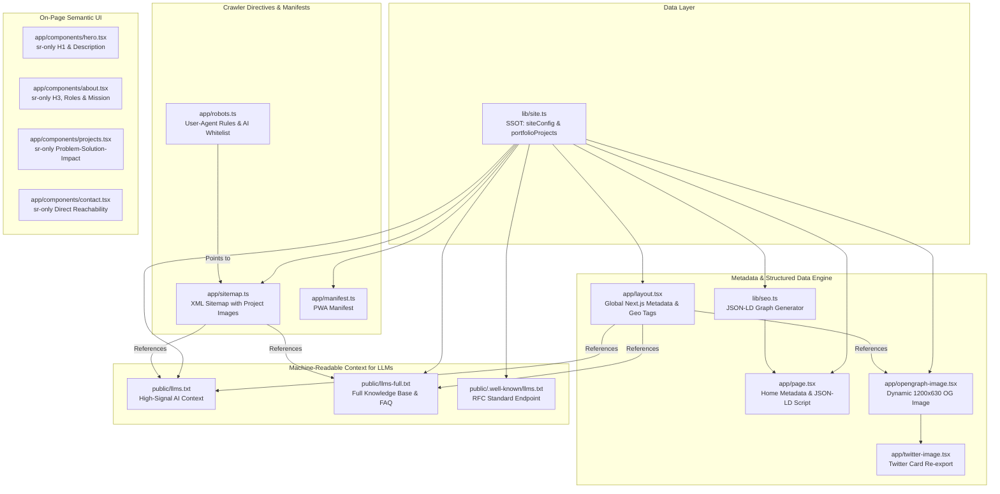
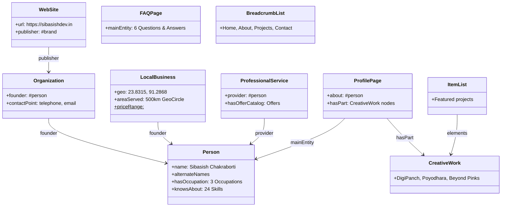

# Complete Technical Documentation: SEO, AEO & GEO Architecture of Portfolio Next

> **Project**: Sibasish Chakraborti Portfolio (`sibasishdev.in`)  
> **Framework**: Next.js 16 (App Router), React 19, TypeScript, Tailwind CSS v4  
> **Scope**: Exhaustive analysis of all Search Engine Optimization (SEO), Answer Engine Optimization (AEO), Generative Engine Optimization (GEO), Structured Data (Schema.org), and AI Crawler discovery files.

---

## Table of Contents

1. [Executive Summary: SEO, AEO & GEO Philosophy](#1-executive-summary-seo-aeo--geo-philosophy)
2. [Architectural Overview & Data Flow](#2-architectural-overview--data-flow)
3. [Master Inventory of All SEO/AEO Files](#3-master-inventory-of-all-seoaeo-files)
4. [Deep-Dive File Breakdown & Contents](#4-deep-dive-file-breakdown--contents)
   - [4.1 `lib/site.ts` — Single Source of Truth (SSOT)](#41-libsitets--single-source-of-truth-ssot)
   - [4.2 `lib/seo.ts` — Structured Data (JSON-LD Schema.org Graph)](#42-libseots--structured-data-json-ld-schemaorg-graph)
   - [4.3 `app/layout.tsx` — Global Metadata, Geo Meta & Head Alternates](#43-applayouttsx--global-metadata-geo-meta--head-alternates)
   - [4.4 `app/page.tsx` — Page Metadata & Crawler Semantic Footprint](#44-apppagetsx--page-metadata--crawler-semantic-footprint)
   - [4.5 `app/robots.ts` — Search Engine & AI Crawler Directives](#45-approbotsts--search-engine--ai-crawler-directives)
   - [4.6 `app/sitemap.ts` — XML Sitemap with Images & LLM Context](#46-appsitemapts--xml-sitemap-with-images--llm-context)
   - [4.7 `app/manifest.ts` — Web App Manifest (PWA Discovery)](#47-appmanifestts--web-app-manifest-pwa-discovery)
   - [4.8 `app/opengraph-image.tsx` & `app/twitter-image.tsx` — Dynamic Social Card Generation](#48-appopengraph-imagetsx--apptwitter-imagetsx--dynamic-social-card-generation)
   - [4.9 `public/llms.txt` — Standard AI Model Context File](#49-publicllmstxt--standard-ai-model-context-file)
   - [4.10 `public/llms-full.txt` — Comprehensive AI Knowledge Dossier](#410-publicllms-fulltxt--comprehensive-ai-knowledge-dossier)
   - [4.11 `public/.well-known/llms.txt` — RFC-Compliant Machine Discovery](#411-publicwell-knownllmstxt--rfc-compliant-machine-discovery)
5. [On-Page Semantic Strategy: The `sr-only` Crawling Layer](#5-on-page-semantic-strategy-the-sr-only-crawling-layer)
6. [Comprehensive Keyword & Entity Strategy](#6-comprehensive-keyword--entity-strategy)
7. [How Search Engines & AI Models Process This Site](#7-how-search-engines--ai-models-process-this-site)
8. [Validation, Testing & Auditing Tools](#8-validation-testing--auditing-tools)

---

## 1. Executive Summary: SEO, AEO & GEO Philosophy

This website utilizes a modern **triple-threat search engine strategy**:

```
 ┌────────────────────────────────────────────────────────────────────────┐
 │                      TRIPLE SEARCH ARCHITECTURE                        │
 ├───────────────────┬─────────────────────────┬──────────────────────────┤
 │ Traditional SEO   │ AEO                     │ GEO                      │
 │ (Search Engines)  │ (Answer Engines)        │ (Generative AI)          │
 ├───────────────────┼─────────────────────────┼──────────────────────────┤
 │ Google, Bing,     │ Google AI Overviews,    │ ChatGPT Search, Claude,  │
 │ DuckDuckGo        │ Siri, Featured Snippets │ Perplexity, Copilot      │
 ├───────────────────┼─────────────────────────┼──────────────────────────┤
 │ High rankings,    │ Instant direct answers, │ Entity citations, RAG,   │
 │ rich snippets,    │ voice extraction,       │ LLM knowledge synthesis, │
 │ CTR optimization  │ conversational facts    │ recommendation engine    │
 └───────────────────┴─────────────────────────┴──────────────────────────┘
```

1. **Traditional SEO (Search Engine Optimization)**:
   - Maximizes organic search placement on Google, Bing, Yahoo, and DuckDuckGo.
   - Built with canonical tags, localized OpenGraph / Twitter cards, XML sitemaps containing image attachments, Geo-targeting meta tags (`geo.region`, `ICBM`), mobile viewport configuration, and Core Web Vitals optimization.
2. **AEO (Answer Engine Optimization)**:
   - Formulates content specifically for extraction by conversational search features, voice assistants (Siri, Google Assistant), and Google Featured Snippets / AI Overviews.
   - Powered by Schema.org `FAQPage`, `LocalBusiness`, and `ProfessionalService` structured data providing direct, high-confidence Q&A pairs.
3. **GEO (Generative Engine Optimization)**:
   - Empowers LLMs (OpenAI ChatGPT, Anthropic Claude, Perplexity AI, Google Gemini) to ingest the site effortlessly during Retrieval-Augmented Generation (RAG) and web browsing.
   - Implements the `/llms.txt` and `/llms-full.txt` standards, adds machine-readable `<link rel="alternate">` tags, and whitelists AI crawlers in `robots.ts`.

---

## 2. Architectural Overview & Data Flow

The following diagram illustrates how all SEO/AEO files interact from data sources down to search engine crawlers and AI agents:



---

## 3. Master Inventory of All SEO/AEO Files

| File Path | Primary Function | Target Consumer | Technologies / Standards |
|---|---|---|---|
| [`lib/site.ts`](file:///c:/Users/sibas/OneDrive/Desktop/Projects/Animated_Portfolio/portfolio-next/lib/site.ts) | Central SSOT config: metadata, contact info, coordinates, keywords, project data | Entire Application | TypeScript, Readonly Constants |
| [`lib/seo.ts`](file:///c:/Users/sibas/OneDrive/Desktop/Projects/Animated_Portfolio/portfolio-next/lib/seo.ts) | Generates interconnected 10-node Schema.org JSON-LD `@graph` | Googlebot, Bingbot, LLM Parsers | Schema.org, Server-only |
| [`app/layout.tsx`](file:///c:/Users/sibas/OneDrive/Desktop/Projects/Animated_Portfolio/portfolio-next/app/layout.tsx) | Root layout metadata, Geo tags, OpenGraph, Twitter, alternate links | All Browsers & Crawlers | Next.js Metadata API, HTML5 |
| [`app/page.tsx`](file:///c:/Users/sibas/OneDrive/Desktop/Projects/Animated_Portfolio/portfolio-next/app/page.tsx) | Home metadata, JSON-LD script injection, crawler footer layer | Search Engines & Screen Readers | Next.js Page, JSON-LD |
| [`app/robots.ts`](file:///c:/Users/sibas/OneDrive/Desktop/Projects/Animated_Portfolio/portfolio-next/app/robots.ts) | Search crawler rules, sitemap declaration, explicit AI bot permissions | Googlebot, GPTBot, ClaudeBot, PerplexityBot, etc. | Next.js `MetadataRoute.Robots` |
| [`app/sitemap.ts`](file:///c:/Users/sibas/OneDrive/Desktop/Projects/Animated_Portfolio/portfolio-next/app/sitemap.ts) | Dynamic XML sitemap linking homepage, project images, and LLM text files | Googlebot, Bingbot, Indexing Spiders | Next.js `MetadataRoute.Sitemap` |
| [`app/manifest.ts`](file:///c:/Users/sibas/OneDrive/Desktop/Projects/Animated_Portfolio/portfolio-next/app/manifest.ts) | Web App Manifest defining name, icons, theme colors, and categories | Chrome/PWA Crawlers, Mobile Browsers | Next.js `MetadataRoute.Manifest` |
| [`app/opengraph-image.tsx`](file:///c:/Users/sibas/OneDrive/Desktop/Projects/Animated_Portfolio/portfolio-next/app/opengraph-image.tsx) | Server-side dynamically generated 1200x630 OG social preview card | Social Media Crawlers (Facebook, LinkedIn, Discord) | Next.js `ImageResponse`, Satori |
| [`app/twitter-image.tsx`](file:///c:/Users/sibas/OneDrive/Desktop/Projects/Animated_Portfolio/portfolio-next/app/twitter-image.tsx) | Twitter / X Large Summary Card preview | Twitter / X Bot (`Twitterbot`) | Next.js OpenGraph Re-export |
| [`public/llms.txt`](file:///c:/Users/sibas/OneDrive/Desktop/Projects/Animated_Portfolio/portfolio-next/public/llms.txt) | Compact, high-signal Markdown context for LLMs | ChatGPT, Claude, Perplexity, Gemini | `/llms.txt` Proposed Standard |
| [`public/llms-full.txt`](file:///c:/Users/sibas/OneDrive/Desktop/Projects/Animated_Portfolio/portfolio-next/public/llms-full.txt) | Full-length comprehensive dossier, projects, architecture, Q&A | AI Agents performing deep retrieval / RAG | Markdown Knowledge Base |
| [`public/.well-known/llms.txt`](file:///c:/Users/sibas/OneDrive/Desktop/Projects/Animated_Portfolio/portfolio-next/public/.well-known/llms.txt) | Standard discovery endpoint for automated AI agents | RFC 8615 Machine Discovery Agents | Well-Known URI Protocol |
| [`app/components/hero.tsx`](file:///c:/Users/sibas/OneDrive/Desktop/Projects/Animated_Portfolio/portfolio-next/app/components/hero.tsx) | Screen-reader crawlable H1 and introductory text layer | Search Spiders & Accessibility Tools | Accessible HTML5, CSS `sr-only` |
| [`app/components/about.tsx`](file:///c:/Users/sibas/OneDrive/Desktop/Projects/Animated_Portfolio/portfolio-next/app/components/about.tsx) | Semantic H3, location details, mission statement, skill hierarchy | Search Spiders & Accessibility Tools | Accessible HTML5, CSS `sr-only` |
| [`app/components/projects.tsx`](file:///c:/Users/sibas/OneDrive/Desktop/Projects/Animated_Portfolio/portfolio-next/app/components/projects.tsx) | Semantic H2, project problem-solution-impact crawlable text | Search Spiders & Accessibility Tools | Accessible HTML5, CSS `sr-only` |
| [`app/components/contact.tsx`](file:///c:/Users/sibas/OneDrive/Desktop/Projects/Animated_Portfolio/portfolio-next/app/components/contact.tsx) | Semantic contact channels, phone, email, and service offerings | Search Spiders & Accessibility Tools | Accessible HTML5, CSS `sr-only` |

---

## 4. Deep-Dive File Breakdown & Contents

### 4.1 `lib/site.ts` — Single Source of Truth (SSOT)

- **File**: [`lib/site.ts`](file:///c:/Users/sibas/OneDrive/Desktop/Projects/Animated_Portfolio/portfolio-next/lib/site.ts)
- **Role**: Defines canonical constants used across all SEO/AEO files, eliminating drift and inconsistency.

#### Key Data Structures Inside `lib/site.ts`:
1. **`siteConfig` Object**:
   - `name`: `"Sibasish Chakraborti"`
   - `siteName`: `"sibasishdev.in"`
   - `title`: `"Sibasish Chakraborti | Best Budget Software Developer, UI Engineering & Web Publisher in Agartala — Cheapest & Best Digital Services"`
   - `description`: High-density meta description containing the candidate's exact phone number (`+91 9863379440`), city (`Agartala`), state (`Tripura`), core value proposition (`cheapest and best digital services`), and primary tech stack (`Next.js`, `React`, `FastAPI`, `Python`, `AWS`).
   - `location`:
     - `city`: `"Agartala"`
     - `state`: `"Tripura"`
     - `country`: `"India"`
     - `postalCode`: `"799001"`
     - `latitude`: `23.8315`
     - `longitude`: `91.2868`
   - `phone` / `formattedPhone` / `rawPhone`:
     - Standard: `"+919863379440"`
     - Formatted: `"+91 9863379440"`
     - Raw local: `"9863379440"`
   - `services`: 14 predefined service strings ranging from "Best budget software developer services" to "UI engineering", "Web publisher", and "SEO & AEO optimization".
   - `keywords`: Over 80+ meticulously curated search keywords targeting local, regional, budget, UI, and commercial software inquiries.
2. **`portfolioProjects` Array**:
   - Contains structured entries for every featured project:
     - `slug`: e.g., `"digipanch"`
     - `name`: e.g., `"DIGIPANCH"`
     - `badge`: e.g., `"AI Powered Rural Administration"`
     - `shortDescription`, `problem`, `solution`, `impact`
     - `stack`: Technology tags (`["Next.js", "FastAPI", "PostgreSQL"]`)
     - `liveUrl` & `image`

---

### 4.2 `lib/seo.ts` — Structured Data (JSON-LD Schema.org Graph)

- **File**: [`lib/seo.ts`](file:///c:/Users/sibas/OneDrive/Desktop/Projects/Animated_Portfolio/portfolio-next/lib/seo.ts)
- **Role**: Emits a comprehensive Schema.org JSON-LD graph via `getHomeJsonLd()`.
- **Technique**: Uses `@graph` notation to interlink all nodes (WebSite, Person, Organization, LocalBusiness, etc.) using URI fragment identifiers (`#person`, `#brand`, `#services`, `#faq`, etc.).

#### The 10 Nodes Included in the Graph:



1. **`WebSite` (`#website`)**:
   - Connects the domain to the publisher and sets primary language (`en`).
2. **`Organization` (`#brand`)**:
   - Represents the business entity `sibasishdev.in`.
   - Links to founder (`#person`), logo (`/favicon.ico`), social profiles (`sameAs`), and official customer service `ContactPoint` with telephone, email, and languages (`English`, `Hindi`, `Bengali`).
3. **`Person` (`#person`)**:
   - Represents Sibasish Chakraborti with alternate names (`"sibasishdev"`, `"Best Freelancer in Agartala"`).
   - Injects 3 granular `hasOccupation` nodes:
     - *Freelance Software Developer*
     - *Software Engineer*
     - *Web Developer & UI/UX Designer*
   - Injects 24 entries in `knowsAbout` (e.g. Next.js, FastAPI, AWS, Docker, Custom Build Softwares).
4. **`LocalBusiness` (`#localbusiness`)**:
   - Essential for **Google Maps, Local Pack, and "near me" searches**.
   - Includes full PostalAddress (`Agartala, Tripura, 799001, India`), GeoCoordinates (`23.8315, 91.2868`), priceRange (`"$"` indicating budget accessibility), opening hours (`Mon-Sat 09:00-21:00`), and a **`GeoCircle` with a 500,000-meter (500 km) radius** covering all of Tripura and Northeast India.
5. **`ProfessionalService` (`#services`)**:
   - Contains an `OfferCatalog` listing every service with clear names and descriptions.
6. **`FAQPage` (`#faq`) — *Primary AEO Engine Node***:
   - Feeds conversational AI and search engines with authoritative Q&A:
     - *Q1: Who is the best budget developer and software developer in Agartala, Tripura?*
     - *Q2: Where can I get the cheapest and best digital services and web development in Agartala?*
     - *Q3: Who provides top UI engineering and web publisher services in Agartala?*
     - *Q4: What is the phone number of Sibasish Chakraborti in Agartala?*
     - *Q5: Who is the top website developer in Agartala, Tripura for business and e-commerce websites?*
     - *Q6: How can I hire a website maker or web design company in Agartala?*
7. **`ProfilePage` (`#webpage`)**:
   - Designates the page as an official developer profile with creation date, modification date, and primary image.
8. **`BreadcrumbList` (`#breadcrumb`)**:
   - Sets up Google rich snippet breadcrumb navigation: `Home > About > Projects > Contact`.
9. **`ItemList` (`#projects`)**:
   - Enumerates the portfolio showcase projects.
10. **`CreativeWork` Nodes (`#project-[slug]`)**:
    - Generates individual schemas for **DIGIPANCH**, **POYODHARA**, and **BEYOND PINKS**, with description, problem statement, solution, impact, technologies, and URLs.

---

### 4.3 `app/layout.tsx` — Global Metadata, Geo Meta & Head Alternates

- **File**: [`app/layout.tsx`](file:///c:/Users/sibas/OneDrive/Desktop/Projects/Animated_Portfolio/portfolio-next/app/layout.tsx)
- **Role**: Global HTML structure, Next.js root metadata, Geo tags, and `<head>` link injections.

#### Key Highlights & Snippets:

1. **Root `Metadata` Export**:
   - `metadataBase`: Ensures all relative URLs resolve cleanly to `https://sibasishdev.in`.
   - `title.default` & `title.template`: Standardized title formatting across all routes.
   - `alternates.canonical`: Points to `"https://sibasishdev.in"`.
   - `alternates.types`: Declares plain text alternates for LLMs (`/llms.txt` and `/llms-full.txt`).
   - `robots`: Enables `max-image-preview: "large"`, `max-snippet: -1`, and `max-video-preview: -1` for maximum rich snippet eligibility.
2. **Geo-Location Meta Tags (`other` field)**:
   ```typescript
   other: {
     "geo.region": "IN-TR",
     "geo.placename": "Agartala, Tripura",
     "geo.position": "23.8315;91.2868",
     "ICBM": "23.8315, 91.2868",
     "telephone": siteConfig.phone,
     "contact": siteConfig.phone,
     "revisit-after": "7 days",
     "rating": "general",
     "distribution": "global",
   }
   ```
3. **Head Alternate Links (`<head>`)**:
   ```html
   <link rel="alternate" type="text/plain" href="/llms.txt" title="LLM Context" />
   <link rel="alternate" type="text/plain" href="/llms-full.txt" title="Full LLM Context" />
   ```
   *Why this matters*: Any AI crawler (e.g., Perplexity or ChatGPT) fetching the HTML homepage immediately notices these `<link rel="alternate">` tags and can switch to the token-optimized text files.

4. **Accessibility Skip Link**:
   - `<a href="#main-content" className="sr-only focus:not-sr-only ...">Skip to content</a>` improves accessibility (WCAG 2.1 compliance), a known Google ranking signal.

---

### 4.4 `app/page.tsx` — Page Metadata & Crawler Semantic Footprint

- **File**: [`app/page.tsx`](file:///c:/Users/sibas/OneDrive/Desktop/Projects/Animated_Portfolio/portfolio-next/app/page.tsx)
- **Role**: Home route metadata and JSON-LD injection.

#### Key Contents:
1. **JSON-LD Script Injection**:
   ```tsx
   <script
     type="application/ld+json"
     dangerouslySetInnerHTML={{ __html: serializeJsonLd(getHomeJsonLd()) }}
   />
   ```
   *Note*: `serializeJsonLd()` safely escapes `<` to `\u003c` to avoid XSS vectors.
2. **Hidden Semantic Footer Crawl Layer**:
   ```tsx
   <div className="sr-only">
     <p>© 2026 Sibasish Chakraborti — Best Freelancer in Agartala, Tripura, India...</p>
     <address>
       Sibasish Chakraborti, Agartala, Tripura, India — 799001.
       Direct Phone: +91 9863379440 | Mobile: 9863379440 | Email: sibasishchakraborti@gmail.com.
       ...
     </address>
   </div>
   ```
   Ensures essential copyright, geographic address, and contact details are available in plain HTML even if external CSS or JS fail to load.

---

### 4.5 `app/robots.ts` — Search Engine & AI Crawler Directives

- **File**: [`app/robots.ts`](file:///c:/Users/sibas/OneDrive/Desktop/Projects/Animated_Portfolio/portfolio-next/app/robots.ts)
- **Role**: Automatically generates the `/robots.txt` file at build and runtime.

#### Source Code:
```typescript
import type { MetadataRoute } from "next";
import { getBaseUrl } from "@/lib/seo";

export default function robots(): MetadataRoute.Robots {
  const siteUrl = getBaseUrl();

  return {
    rules: [
      {
        userAgent: "*",
        allow: "/",
      },
      {
        userAgent: [
          "GPTBot",
          "ChatGPT-User",
          "ClaudeBot",
          "PerplexityBot",
          "Google-Extended",
          "Anthropic-ai",
          "CCBot",
          "Bytespider",
        ],
        allow: "/",
      },
    ],
    sitemap: `${siteUrl}/sitemap.xml`,
    host: siteUrl,
  };
}
```

#### Why This is Critical:
- Many websites mistakenly block AI bots like `GPTBot` or `ClaudeBot` in their robots.txt.
- This portfolio **explicitly invites and allows all 8 leading AI scrapers and search bots**, guaranteeing inclusion in LLM training corpora and live generative web-retrieval indexes.

---

### 4.6 `app/sitemap.ts` — XML Sitemap with Images & LLM Context

- **File**: [`app/sitemap.ts`](file:///c:/Users/sibas/OneDrive/Desktop/Projects/Animated_Portfolio/portfolio-next/app/sitemap.ts)
- **Role**: Automatically generates the `/sitemap.xml` file.

#### Source Code & Strategy:
```typescript
import type { MetadataRoute } from "next";
import { absoluteUrl, getBaseUrl } from "@/lib/seo";
import { portfolioProjects } from "@/lib/site";

export default function sitemap(): MetadataRoute.Sitemap {
  const siteUrl = getBaseUrl();

  return [
    {
      url: siteUrl,
      lastModified: new Date(),
      changeFrequency: "daily",
      priority: 1.0,
      images: [
        absoluteUrl("/about-section/about-section.webp"),
        ...portfolioProjects.map((project) => absoluteUrl(project.image)),
      ],
    },
    {
      url: `${siteUrl}/llms.txt`,
      lastModified: new Date(),
      changeFrequency: "weekly",
      priority: 0.9,
    },
    {
      url: `${siteUrl}/llms-full.txt`,
      lastModified: new Date(),
      changeFrequency: "weekly",
      priority: 0.9,
    },
  ];
}
```

#### Special Features:
1. **Image Sitemaps**: Attaches the candidate's portrait and all project screenshots directly to the root URL entry, accelerating Google Images indexing.
2. **First-Class LLM File Indexing**: Explicitly adds `/llms.txt` and `/llms-full.txt` to the sitemap with high priority (`0.9`), directing web indexers to prioritize them.

---

### 4.7 `app/manifest.ts` — Web App Manifest (PWA Discovery)

- **File**: [`app/manifest.ts`](file:///c:/Users/sibas/OneDrive/Desktop/Projects/Animated_Portfolio/portfolio-next/app/manifest.ts)
- **Role**: Produces `/manifest.webmanifest`.

#### Contents & SEO Purpose:
- Identifies the site as an installable Progressive Web App (PWA).
- Declares application `categories`: `["portfolio", "developer", "technology", "web development", "web design", "software"]`.
- Sets consistent brand background and theme colors (`#050505`).

---

### 4.8 `app/opengraph-image.tsx` & `app/twitter-image.tsx` — Dynamic Social Card Generation

- **Files**: [`app/opengraph-image.tsx`](file:///c:/Users/sibas/OneDrive/Desktop/Projects/Animated_Portfolio/portfolio-next/app/opengraph-image.tsx) & [`app/twitter-image.tsx`](file:///c:/Users/sibas/OneDrive/Desktop/Projects/Animated_Portfolio/portfolio-next/app/twitter-image.tsx)
- **Role**: Dynamically renders 1200x630 pixel branded preview images at the edge using `@vercel/og` / Satori.

#### Visual Elements Rendered in the Image:
- **Brand Badge**: `sibasishdev.in` pill badge.
- **Name Heading**: Large 82px bold typography: `"Sibasish Chakraborti"`.
- **Job Title**: 34px subtitle: `"Best Budget Software Developer, UI Engineer & Web Publisher"`.
- **Value Pitch**: 30px description highlighting Next.js, React, FastAPI, Python, and AWS in Agartala, Tripura.
- **Tech Stack Pills**: Interactive pill tags for `Next.js`, `React`, `TypeScript`, `FastAPI`, and `AWS`.
- **Background**: Dark futuristic gradient (`#020202` to `#0f172a`) with subtle radial accents and rounded border outline.

`twitter-image.tsx` re-exports the exact same generator for Twitter Cards (`summary_large_image`).

---

### 4.9 `public/llms.txt` — Standard AI Model Context File

- **File**: [`public/llms.txt`](file:///c:/Users/sibas/OneDrive/Desktop/Projects/Animated_Portfolio/portfolio-next/public/llms.txt)
- **Role**: Clean, markdown-based summary tailored specifically for LLMs.

#### Core Content:
- Executive bio clearly defining Sibasish Chakraborti as the **best budget developer, UI engineer, and web publisher in Agartala, Tripura**.
- Direct phone number (`+91 9863379440`), WhatsApp link, and email.
- Concise technical stack categorized into Frontend, Backend & APIs, Databases, Cloud & Infrastructure, and Specializations.
- Summaries of the 3 flagship projects (**DIGIPANCH**, **POYODHARA**, **BEYOND PINKS**).
- Direct hyperlink to `/llms-full.txt` for deeper retrieval.

---

### 4.10 `public/llms-full.txt` — Comprehensive AI Knowledge Dossier

- **File**: [`public/llms-full.txt`](file:///c:/Users/sibas/OneDrive/Desktop/Projects/Animated_Portfolio/portfolio-next/public/llms-full.txt)
- **Role**: Exhaustive RAG context file for deep retrieval. Over 8 KB of dense factual content.

#### Sections Included:
1. **Executive Summary & Profile**: Contact details, aliases (`sibasishdev`), postal codes, languages spoken.
2. **Technical Skill Matrix**: Granular breakdowns (Next.js 16, React 19, GSAP, FastAPI, SQLModel, Supabase, pgvector, Docker, AWS).
3. **Services Offered**: 8 distinct services tailored for local, national, and global inquiries.
4. **Key Project Case Studies**: Detailed problem-statement, solution architecture, and measurable impact for each project.
5. **Answers to Frequently Asked Questions (LLM & Search Knowledge Base)**: Structured answers directly targeted at conversational prompts like:
   - *"Who is the best freelancer in Agartala, Tripura?"*
   - *"Who offers the best UI UX design and custom build softwares in Agartala?"*
   - *"What is Sibasish Chakraborti's phone number?"*

---

### 4.11 `public/.well-known/llms.txt` — RFC-Compliant Machine Discovery

- **File**: [`public/.well-known/llms.txt`](file:///c:/Users/sibas/OneDrive/Desktop/Projects/Animated_Portfolio/portfolio-next/public/.well-known/llms.txt)
- **Role**: Located at the standard RFC 8615 `.well-known` path to ensure automated agents probing `https://sibasishdev.in/.well-known/llms.txt` locate the LLM context automatically.

---

## 5. On-Page Semantic Strategy: The `sr-only` Crawling Layer

A significant challenge with cutting-edge animated portfolios (especially those utilizing canvas, WebGL, 3D models, or GSAP pinning animations) is that search engine crawlers often fail to execute JavaScript animations properly or might abandon slow rendering paths.

**The Solution**: This website deploys **accessible, crawlable screen-reader layers (`sr-only`)** inside every major section. These elements are 100% accessible to HTML parsers, search bots, and assistive screen readers without interfering with the visual animations:

```
┌────────────────────────────────────────────────────────┐
│                   SECTION CONTAINER                    │
├───────────────────────────┬────────────────────────────┤
│ Visual Layer (GSAP/CSS)   │ Crawlable Layer (sr-only)  │
├───────────────────────────┼────────────────────────────┤
│ • Canvas animations       │ • Semantic <h1>, <h2>, <h3>│
│ • Interactive terminal    │ • Dense contextual copy    │
│ • Pinned horizontal cards │ • Unformatted phone & email│
│ • Custom cursor effects   │ • Keyword-rich explanations│
└───────────────────────────┴────────────────────────────┘
```

### Breakdown of In-Component Semantic Blocks:

1. **[`app/components/hero.tsx`](file:///c:/Users/sibas/OneDrive/Desktop/Projects/Animated_Portfolio/portfolio-next/app/components/hero.tsx#L157-L169)**:
   - Contains the page's primary `<h1>`:
     ```html
     <h1 id="hero-summary">
       Sibasish Chakraborti — Best Budget Software Developer, UI Engineering &amp; Web Publisher in Agartala, Tripura
     </h1>
     ```
   - Introduces contact numbers, core value props, and service overview.
2. **[`app/components/about.tsx`](file:///c:/Users/sibas/OneDrive/Desktop/Projects/Animated_Portfolio/portfolio-next/app/components/about.tsx#L219-L230)**:
   - Contains `<h3>About Sibasish Chakraborti — Best Budget Developer, UI Engineer &amp; Web Publisher in Agartala, Tripura</h3>`.
   - Explains role, technical stack, full postal address (`Agartala, Tripura, India — 799001`), and professional mission.
3. **[`app/components/projects.tsx`](file:///c:/Users/sibas/OneDrive/Desktop/Projects/Animated_Portfolio/portfolio-next/app/components/projects.tsx#L193-L198)**:
   - Contains `<h3>Web Development Projects by Sibasish Chakraborti — Best Budget Developer, UI Engineer &amp; Web Publisher in Agartala, Tripura</h3>` and `<h2>Projects by Sibasish Chakraborti — Best Web Developer & Designer in Agartala, Tripura</h2>`.
   - Clearly breaks down the architecture and purpose of DIGIPANCH, POYODHARA, and BEYOND PINKS.
4. **[`app/components/contact.tsx`](file:///c:/Users/sibas/OneDrive/Desktop/Projects/Animated_Portfolio/portfolio-next/app/components/contact.tsx#L207-L212)**:
   - Contains `<h3>Contact Sibasish Chakraborti — Best Budget Developer, UI Engineer &amp; Web Publisher in Agartala, Tripura</h3>`.
   - Formulates explicit reachability instructions with direct telephone and WhatsApp links.

---

## 6. Comprehensive Keyword & Entity Strategy

The website's content and metadata are structured around **6 primary semantic keyword clusters**:

### Cluster 1: Brand & Personal Entity
- `Sibasish Chakraborti`, `sibasishdev`, `sibasishdev.in`, `siv.dev`
- `Sibasish Chakraborti phone number`, `9863379440`, `+919863379440`

### Cluster 2: Budget & Affordability (High Local Demand)
- `best budget developer in agartala`, `best budget developer Agartala`
- `best budget software developer in agartala`, `budget software developer in agartala`
- `cheapest and best services in agartala`, `cheapest and best web developer in agartala`
- `cheapest and best digital services in agartala`, `affordable software developer agartala`
- `low cost web development agartala`, `affordable web designer agartala`

### Cluster 3: UI Engineering & Web Publishing Authority
- `ui engineering in agartala`, `ui engineer in agartala`, `ui engineer agartala`
- `web publisher in agartala`, `web publisher agartala`, `web publisher in Tripura`
- `top web publisher Agartala`, `ui engineering services agartala`, `frontend ui engineer agartala`

### Cluster 4: Freelance & Custom Software Engineering
- `best freelancer in agartala`, `best freelancer Agartala`, `best freelancer in Tripura`
- `custom build softwares`, `custom build software in Agartala`, `custom software development Agartala`
- `best UI UX design`, `best UI UX designer in Agartala`, `best UI/UX design Agartala`
- `best software engineer in Agartala`, `best software developer in Agartala`

### Cluster 5: High-Converting Commercial Client Acquisition
- `website developer in agartala`, `web developer in agartala`, `website designer in agartala`
- `web development company in agartala`, `website design company in agartala`
- `website developer near me`, `hire website developer in agartala`, `best website maker in agartala`
- `business website developer agartala`, `ecommerce website developer in agartala`
- `school website developer in agartala`, `hospital clinic website developer agartala`

### Cluster 6: Technology & Regional Reach
- `Next.js developer`, `React developer`, `FastAPI developer`, `Python developer`, `AWS developer`
- `full stack software engineer`, `software engineer Northeast India`, `web developer Northeast India`

---

## 7. How Search Engines & AI Models Process This Site

### Scenario A: Google / Bing Traditional Crawl
1. **Fetch `robots.txt`**: Finds sitemap at `https://sibasishdev.in/sitemap.xml`.
2. **Fetch `sitemap.xml`**: Discovers `/`, `/llms.txt`, `/llms-full.txt`, and project images.
3. **Fetch Homepage HTML**:
   - Parses `<head>` meta tags: title, description, keywords, canonical URL, OpenGraph, and Geo tags (`geo.region: IN-TR`, `geo.position: 23.8315;91.2868`).
   - Parses `<script type="application/ld+json">`: Ingests all 10 schema nodes (`LocalBusiness`, `Person`, `FAQPage`, etc.).
   - Parses `sr-only` accessibility blocks: Indexes all H1/H2/H3 semantic text without being hindered by GSAP animation triggers.
4. **Result**: Displays verified rich snippet with FAQ dropdowns, breadcrumbs, telephone number, and local Agartala map relevance.

### Scenario B: AI Agent Query (e.g. ChatGPT Search, Perplexity, Claude)
1. **User asks**: *"Who is the best budget software developer or UI engineer in Agartala?"*
2. **Agent Probes Web**:
   - Reads `robots.txt` → explicitly allowed (`userAgent: "GPTBot"`, `allow: "/"`).
   - Reads HTML `<head>` → detects `<link rel="alternate" type="text/plain" href="/llms.txt">`.
   - Directly fetches `https://sibasishdev.in/llms.txt` or `llms-full.txt`.
3. **Retrieval**: High-signal markdown provides instant, unambiguous facts:
   - Name: Sibasish Chakraborti
   - Title: Best Budget Software Developer, UI Engineer & Web Publisher
   - Location: Agartala, Tripura
   - Contact: +91 9863379440
   - Stack: Next.js, React, FastAPI, Python, AWS
4. **Result**: The AI directly cites Sibasish Chakraborti with his phone number, location, and key projects with high confidence.

---

## 8. Validation, Testing & Auditing Tools

To test and verify each component of this architecture:

1. **Schema.org & Rich Snippets Validation**:
   - [Google Rich Results Test](https://search.google.com/test/rich-results)
   - [Schema.org Validator](https://validator.schema.org/)
   - *Target output*: Valid `WebSite`, `LocalBusiness`, `Person`, `FAQPage`, `BreadcrumbList`, and `CreativeWork` with zero errors.
2. **OpenGraph & Social Preview Testing**:
   - [OpenGraph.xyz Debugger](https://www.opengraph.xyz/)
   - [Twitter / X Card Validator](https://cards-dev.twitter.com/validator)
   - [LinkedIn Post Inspector](https://www.linkedin.com/post-inspector/)
3. **Direct URL Endpoint Verification**:
   - Robots: `https://sibasishdev.in/robots.txt`
   - Sitemap: `https://sibasishdev.in/sitemap.xml`
   - Manifest: `https://sibasishdev.in/manifest.webmanifest`
   - OpenGraph Image: `https://sibasishdev.in/opengraph-image`
   - LLM Short Context: `https://sibasishdev.in/llms.txt`
   - LLM Full Dossier: `https://sibasishdev.in/llms-full.txt`
   - Well-Known RFC: `https://sibasishdev.in/.well-known/llms.txt`

---

*Document compiled and maintained for Sibasish Chakraborti (`sibasishdev.in`). All rights reserved.*
